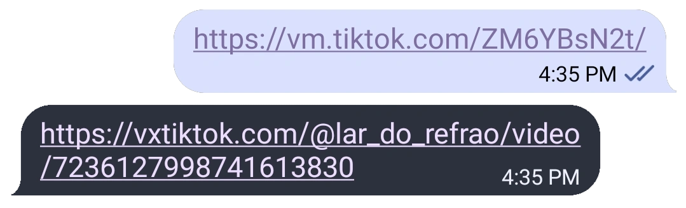

<p align="left">

</p>

## tiktok-to-vxtiktok

A Telegram Python bot that converts TikTok links to VxTikTok links

<picture>
  
</picture>

<p align="center">
    <a href="https://github.com/psf/black" alt="Code style: black">
        </a>
    <a href="https://www.codefactor.io/repository/github/z1xus/tiktok-to-vxtiktok">
        </a>
    <a href="https://github.com/Z1xus/tiktok-to-vxtiktok/issues?q=is%3Aissue+is%3Aopen+" alt="GitHub issues">
        </a>
    <a href="https://github.com/Z1xus/tiktok-to-vxtiktok/pulls?q=is%3Apr+is%3Aopen+" alt="GitHub pull requests">
        </a>
</p>

Accepts both shortened and full TikTok links, works in group chats, PMs and inline.  
You can try it out [here](https://t.me/tiktok_to_vxtiktok_bot).

### Usage:
1. Clone the repository
```bash
git clone https://github.com/Z1xus/tiktok-to-vxtiktok
```
2. Install dependencies
```bash
pip install -r .\requirements.txt
```
3. Configure your .env
```Shell
# get one from botfather (https://t.me/BotFather)
TOKEN=YOUR_BOT_TOKEN

# https://www.mongodb.com/docs/manual/reference/connection-string/
MONGODB_URI=YOUR_MONGODB_URI
```
4. Run it 
```bash
python3 .\main.py
```
